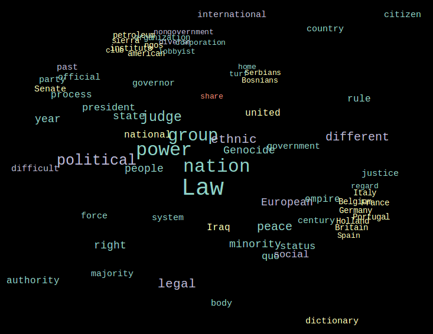

#### Currently under development!!!

# word-mesh
A wordcloud/wordmesh generator that allows users to extract keywords from text, and create a simple and interpretable wordcloud.

## Why word-mesh?

Most popular open-source wordcloud generators ([word_cloud](https://github.com/amueller/word_cloud), [d3-cloud](https://github.com/jasondavies/d3-cloud), [echarts-wordcloud](https://github.com/ecomfe/echarts-wordcloud)) focus more on the aesthetics of the visualization than on effectively conveying textual features. **word-mesh** strikes a balance between the two and uses the various statistical, semantic and grammatical features of the text to inform visualization parameters.

#### Features:
 - *keyword extraction*: In addition to 'word frequency' based extraction techniques, word-mesh supports graph based methods like **textrank**, **sgrank**, **bestcoverage** and **divrank**.
 
 - *word clustering*: Words can be grouped together on the canvas based on their semantic similarity, co-occurence frequency, and other grammatical properties.
 
 - *keyword filtering*: Extracted keywords can be filtered based on pos tags and named entity types.
 
 - *fontcolors and fontsizes*: These can be set based on the following criteria - word frequency, pos-tags, word-longevity.
 

## How it works?
**word-mesh** uses [spacy](https://spacy.io/)'s pretrained language models to gather textual features, graph based algorithms to extract keywords, [Multidimensional Scaling](https://en.wikipedia.org/wiki/Multidimensional_scaling) to place these keywords on the canvas and a [force-directed algorithm](#Visualizing-the-FDA) to optimize inter-word spacing.

## Examples
Here's a visalization of the force-directed algorithm. The words are extracted using **textrank** from a textbook on international law, and are grouped together on the canvas based on their co-occurence frequency. The colours indidcate the pos tags of the words.

