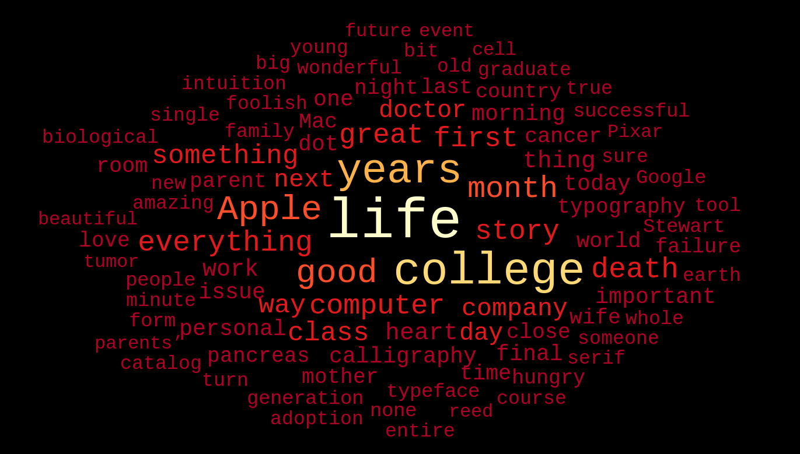
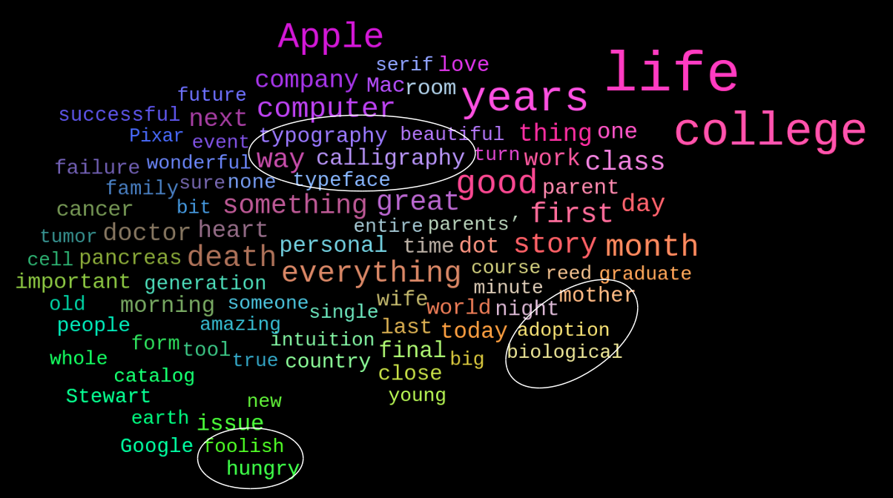
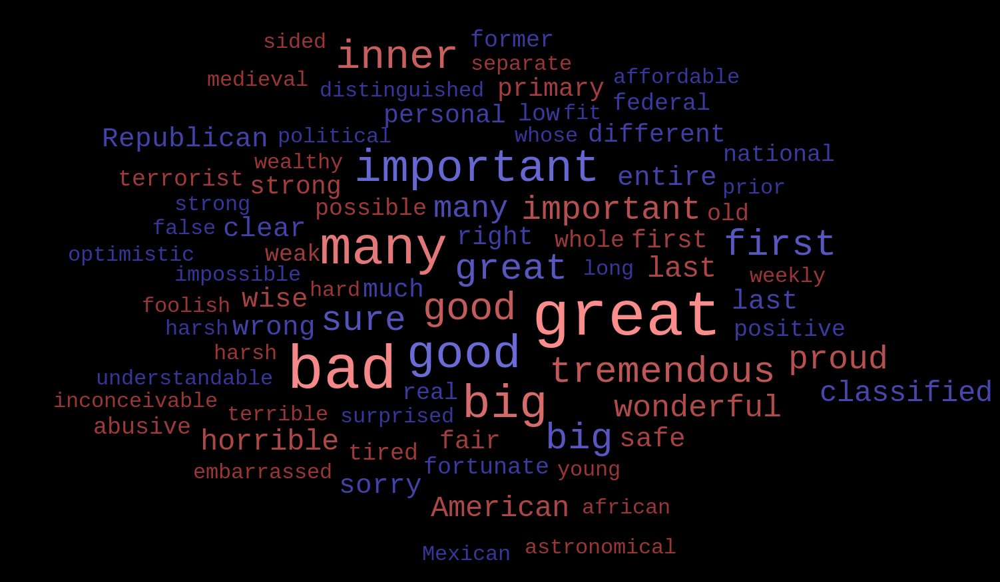
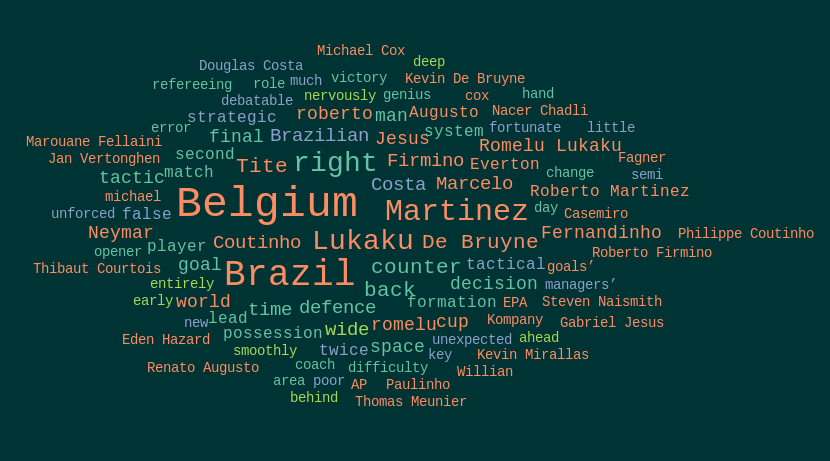

## Examples

This wordmesh was created from Steve Job's famous commencement speech at Stanford. The keywords are extracted using *textrank* and clustered based on their *scores*. The font colors and font sizes are also a function of the scores. *[Code](examples/examples.ipynb)*

This is from the same text, but the clustering has been done based on *co-occurrence frequency* of keywords. The colors have been assigned using the same criteria used to cluster them. 

This is quite apparent from the positions of the words. You can see the words like 'hungry' and 'foolish' have been grouped together, since they occur close to each other in the text as part of the famous quote **"Stay hungry. Stay foolish"**. *[Code](examples/examples.ipynb)*

This is a wordmesh of all the *adjectives* used in a 2016 US Presidential Debate between Donald Trump and Hillary Clinton. The words are clustered based on their *meaning*, with the font size indicating the usage frequency, and the color corresponding to which candidate used them. *[Code](examples/examples_labelled.ipynb)*

This example is taken from a news article on the Brazil vs Belgium 2018 Russia WC QF. The colors correspond to the *POS tags* of the words. The second figure is the same wordmesh clustered based on the words' *co-occurrence frequency*. *[Code](examples/examples.ipynb)*

 